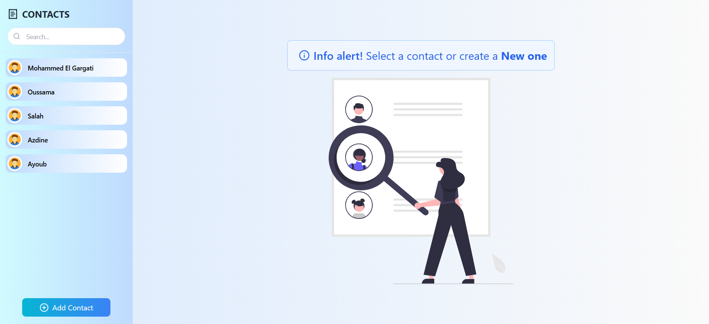
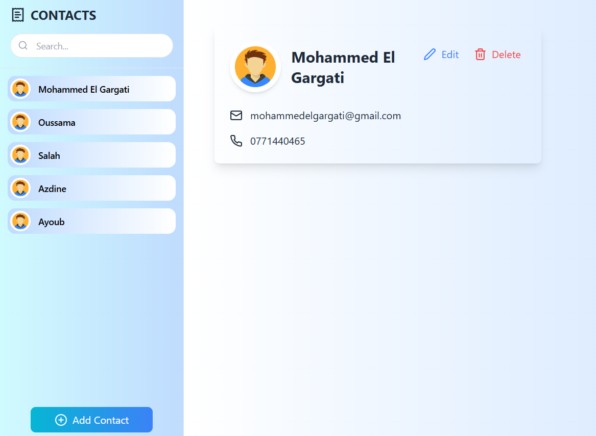
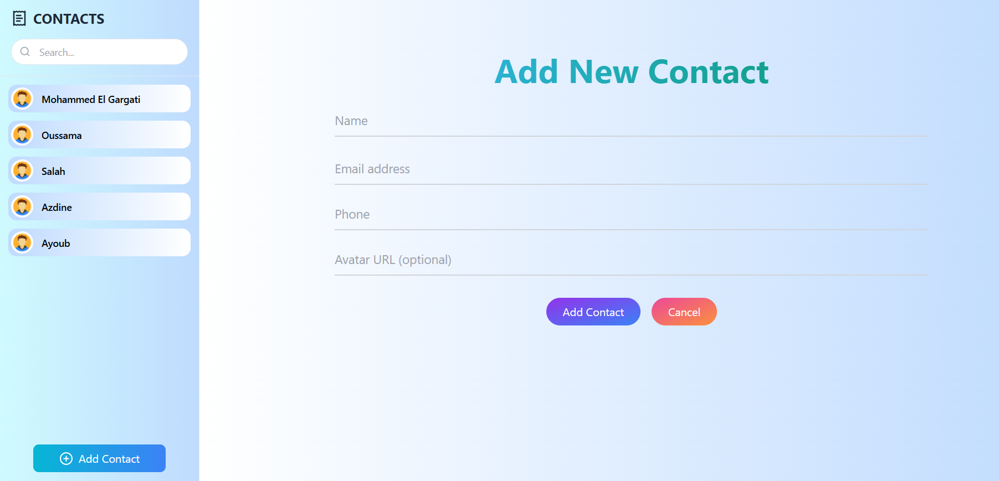

# Contact Management App

### Une application moderne pour la gestion des contacts

---

## Table des matières

- [Aperçu](#aperçu)
- [Fonctionnalités](#fonctionnalités)
- [Technologies](#technologies)
- [Déploiement](#déploiement)
- [Auteur](#auteur)

---

## Aperçu

**Contact Management App** est une application intuitive conçue pour organiser efficacement vos contacts. Avec une interface simple et élégante, cette application permet de créer, gérer et rechercher vos contacts en toute simplicité. Que ce soit sur un ordinateur, une tablette ou un smartphone, **Contact Management App** s'adapte parfaitement à tous les écrans grâce à son design responsive.

Le projet utilise **React.js** et **Tailwind CSS** pour offrir une expérience utilisateur fluide et rapide. Il est facile à personnaliser et à intégrer dans vos propres projets.

---

## Aperçu visuel

### Desktop View

---

## Fonctionnalités

- **Création de contacts** : Formulaire pour ajouter de nouveaux contacts avec champs de saisie intuitifs.
- **Recherche de contacts** :
  - Filtrez les contacts par nom, email ou numéro de téléphone.
- **Gestion des contacts** :
  - Visualisez, mettez à jour et supprimez les contacts.
- **Filtres dynamiques** : Affichez les contacts selon différents critères :
  - Tous les contacts.
  - Contacts favoris.
  - Contacts récents.
- **Notifications** : Utilisation de **React Toastify** pour des notifications informatives (ajout, modification, suppression, etc.).
- **Design responsive** : Optimisé pour une utilisation fluide sur tous les appareils.
- **Transitions fluides** : Animations et effets modernes pour une expérience interactive.

---

## Technologies

- **React.js** : Framework JavaScript pour construire une interface utilisateur dynamique.
- **Tailwind CSS** : Framework CSS utilitaire pour un design rapide et flexible.
- **React Toastify** : Bibliothèque pour gérer les notifications interactives.

---

## Déploiement

L'application est déployée sur [Contact Management App](https://github.com/Elgargati/Contact_Management_App).

---

## Auteur

- **Mohammed El Gargati**
- GitHub : [Elgargati](https://github.com/Elgargati)

---

N'hésitez pas à me contacter si vous avez des questions ou des suggestions !
